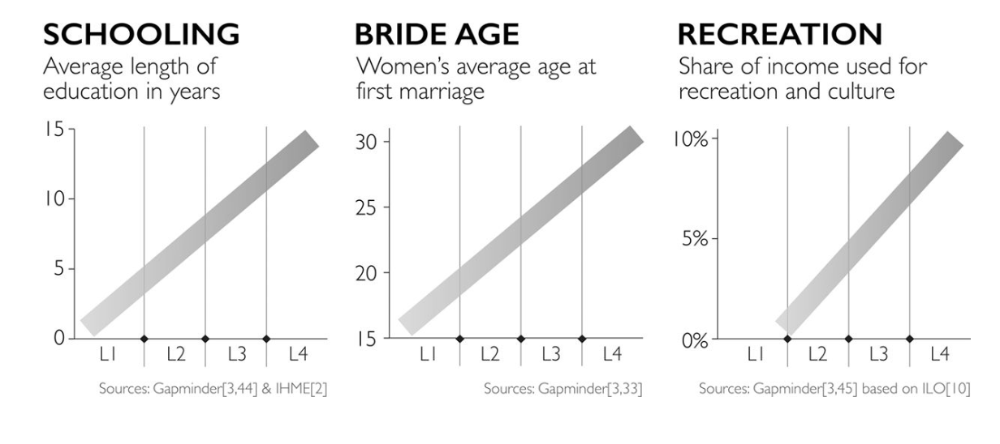
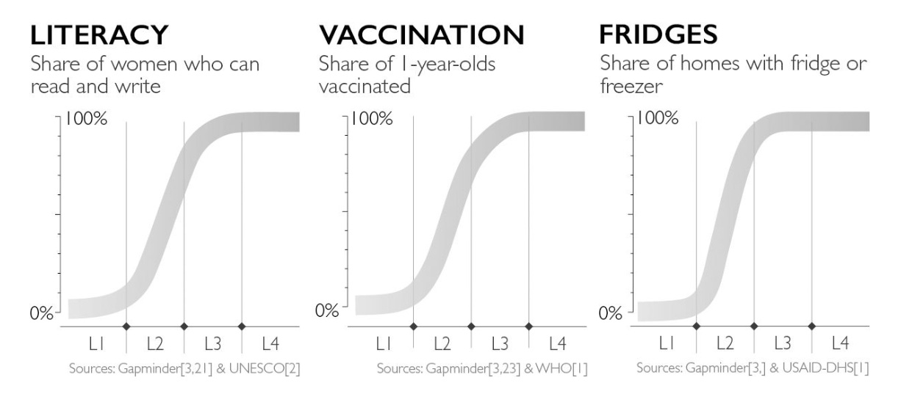
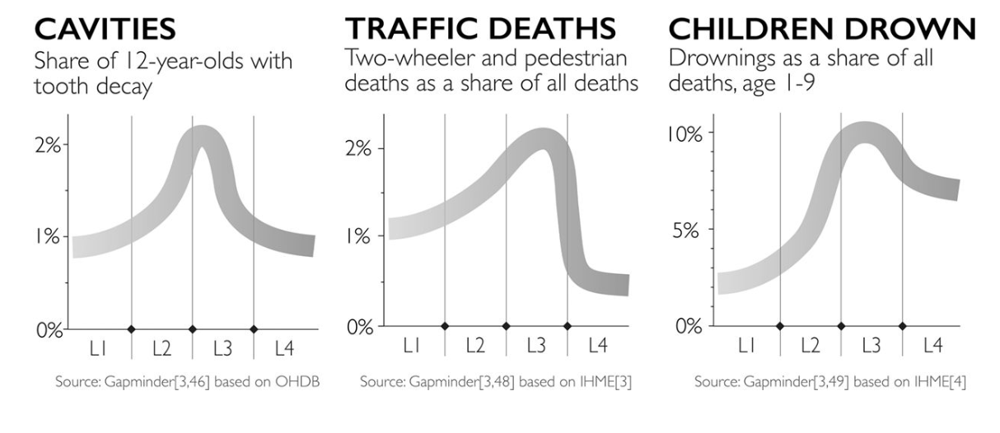

# Chapter 3: The Straight Line Instinct

## Summary
**Factfulness is ... recognizing the assumption that a line will just continue straight**, and remembering that such lines are rare in reality. To control the straight line instinct, **don't assume straight lines** and **remember that curves come in different shapes**.

### Straight Lines

### S-Bends

### Slides

### Humps

### Doubling Lines

